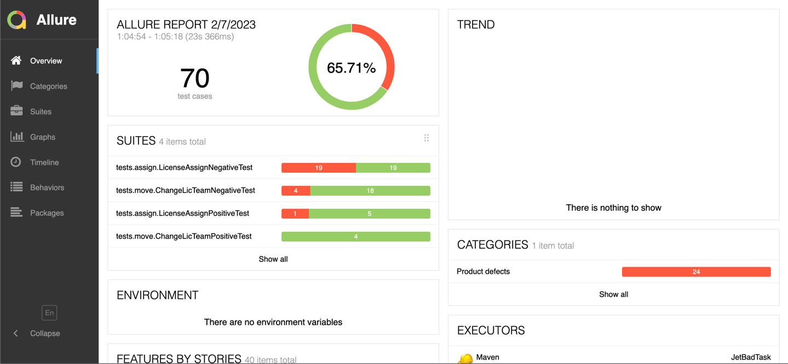
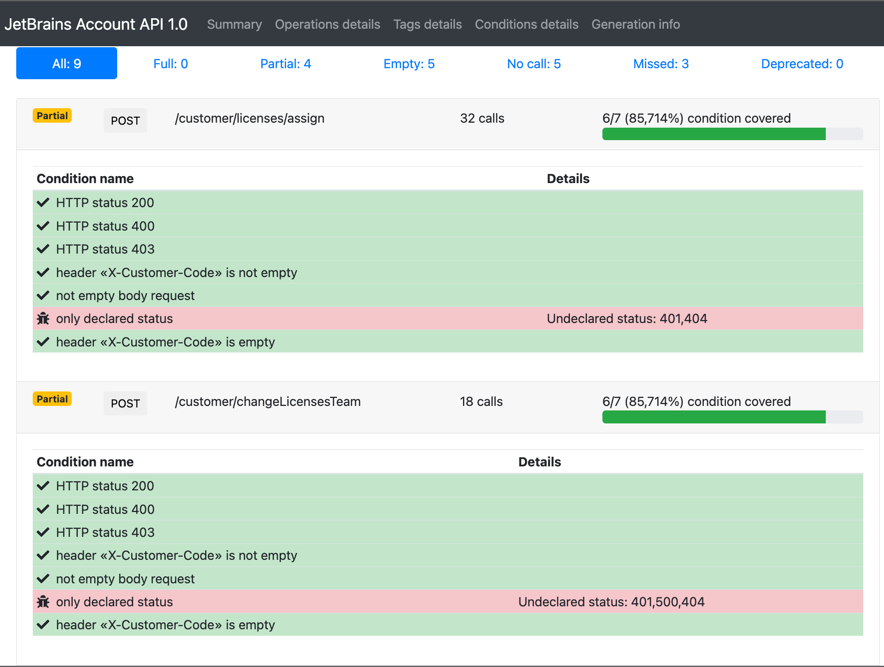

# Technologies used

* [RestAssured](https://rest-assured.io/) - rest services valiation framework
* [Allure](https://docs.qameta.io/allure/) - cool test result reporting
* [Jasypt](http://www.jasypt.org/) - encryption framework used to simplify secret management
* [Jasypt Maven Plugin](https://github.com/ulisesbocchio/jasypt-spring-boot#encryption) - generates encrypted values
* [Swagger-Coverage](https://github.com/viclovsky/swagger-coverage) - RestAssured plugin to measure API test coverage based on Swagger doc
* [Github Actions](https://github.com/KateOgar/JetBADTask/actions/runs/4118767699) integrated

# Build and Run

This project uses Maven for build orchestration - simply run `mvn install` to compile it

It is important to provide `CONFIG_SECRET` environment variable so secrets are decrypted and properly injected into TestRun. 
**Do not commit any secrets information, please refer to [Secret Management]() section of that document to see how to do that**

```shell
CONFIG_SECRET=<secret> mvn test
```
# Secret Management

We simplified secret management in that project to use of single shared secret for decrpytion of `configuration.properties` file. 
This shared secret obviously shouldn't be stored in that repository and should be in a safe place. 
We read _shared secret_ from environment variable `CONFIG_SECRET` and use it for decryption

## How to Encrypt

When you'll need to encrypt new secret or change existing one use following command
```shell
mvn jasypt:encrypt-value -Djasypt.encryptor.password="<secret>" -Djasypt.plugin.value="<value to secret>"
```
This will produce a string with format like `ENC(abrakadabra)` you can store safely in `configuration.properties` file.

## How to Decrypt

Within project we use `data.Configuration` class to access both plain and encrypted properties from `configuration.properties` file.
If you want to decrypt encrypted property from commandline you can use following command

```shell
mvn jasypt:decrypt-value -Djasypt.encryptor.password="<secret>" -Djasypt.plugin.value="<value to decrypt>"
```

[Jasypt](http://www.jasypt.org/maven.html) - used for decryption of secret properties
[Jasypt Maven Plugin](https://github.com/ulisesbocchio/jasypt-spring-boot#encryption) - generates encrypted values


# Test Reports

All reports are going to be generated if you run `mvn site`

## Allure Report



For reporting of test success/failure in this project we use [Allure](https://docs.qameta.io/allure/) reporting which allows to gather rich report along
with links to BugTracker and attached logs for easier test support

You can see report after running `mvn site` in following location `target/site/allure-maven-plugin/index.html`

## API Coverage



API method coverage is done using https://github.com/viclovsky/swagger-coverage plugin which plugs in
to RestAssured via `.filter(new SwaggerCoverageRestAssured(coverageWriter))` and then compare against
Swagger definition https://account.jetbrains.com/api/v1/swagger.json

You can see report after running `mvn site` in following location `target/site/swagger-coverage-report.html`

# Revert testing data state
1. Change license team tests have the extension, which returns state of testing data to initial automatically
2. Assign license state tests need to be returned manually.
After running tests go to team teamDefaultCompanyAdmin_Auto (2292140) and teamWithAdminRole_Auto (2291834), select 
all the teams licenses and revoke them. 
